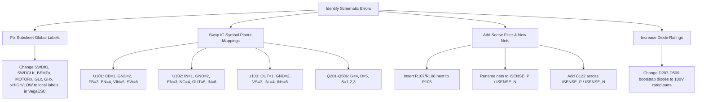

# Atlas ESC Design Review & Critical Audit

**Project:** Atlas Multi-Channel ESC (KiCad 10.0, 5 hierarchical sheets: 1 root + 4 instanced Motor sheets, no PCB layout started yet)  
**Date:** June 22, 2026  
**Auditor:** Antigravity AI Coding Assistant  
**Schematic Status:** **FAILED (CRITICAL REVISION REQUIRED)**  

---

## Executive Summary

A ruthless, pin-by-pin audit of the latest schematic refactor (`Atlas.kicad_sch` and `VegaESC.kicad_sch`) has revealed **seven fatal design errors** that will cause immediate PCB destruction, short circuits, or complete programming/operational failure. 

Before pushing this netlist to the PCB Editor, the schematic **must** be updated to resolve these errors. Doing so now will prevent a wasted PCB fabrication run and destroyed components.

---

## 1. Pinout & Logic Mapping

This section audits the control lines, MCU programming signals, and sheet-to-sheet isolation.

### 🛑 CRITICAL: Global Net Shorts on Hierarchical Sheets
The sub-sheet `VegaESC.kicad_sch` is instanced 4 times (for Motor 1, 2, 3, and 4). However, it uses **Global Labels** (`global_label` in KiCad S-expression) instead of local or hierarchical labels for several sheet-specific signals. This causes KiCad to merge these nets across all 4 channels, short-circuiting them together.
*   **SWD Programming Lines Shorted:** The `SWDIO` and `SWDCLK` nets of all 4 MCUs (`U203`, `U303`, `U403`, `U503`) are shorted together on a single global bus. It will be impossible to program, debug, or flash firmware to any MCU individually due to bus contention.
*   **Gate Driver Inputs Shorted:** The logic control lines `AHIGH`, `ALOW`, `BHIGH`, `BLOW`, `CHIGH`, and `CLOW` are shorted across all 4 channels. Driving a PWM signal on one channel will turn on the FETs of all 4 channels simultaneously.
*   **Back-EMF Sensing Lines Shorted:** The back-EMF phase-voltage dividers (`BEMFA`, `BEMFB`, `BEMFC`, `BEMF_COMMON`) are shorted across all 4 sub-sheets. Individual sensorless motor commutation (AM32) is completely broken.
*   **Phase Outputs and Gate Drives Shorted:** The motor phase outputs (`MOTORA`, `MOTORB`, `MOTORC`) and high/low gate drives (`GLA`, `GLB`, `GLC`, `GHA`, `GHB`, `GHC`) are shorted across all channels.
*   **Action Required:** Open `VegaESC.kicad_sch` and replace all global labels for these nets with standard **local labels**. Local labels are automatically namespaced by KiCad per sheet instance (e.g., `/Motor_1/AHIGH` vs `/Motor_2/AHIGH`), isolating the channels.

### ⚠️ WARNING: Shared Reset (NRST)
*   **Current State:** The reset pins (`Pin 4, NRST`) of all four MCUs (`U203`, `U303`, `U403`, `U503`) are tied to the same global `NRST` net. 
*   **Risk:** While a global reset is acceptable, if any individual MCU experiences a local brownout or reset condition, it will pull the line low and reset *all* four MCUs.
*   **Action Required:** Change `NRST` to a local label inside `VegaESC.kicad_sch` to isolate MCU resets, or verify that a global reset behavior is desired for the system.

### Labeled Pin Verification (BOOT0)
*   **BOOT0 Pin Pull-Downs:** Verified that `BOOT0` (Pin 1) of each MCU (`U203`, `U303`, `U403`, `U503`) is pulled down to GND via 10kΩ resistors (`R231`, `R331`, `R431`, `R531`). This correctly prevents the MCUs from entering the system bootloader on startup.

---

## 2. Power Delivery & Decoupling

This section audits the decoupling networks, voltage ratings, and regulator margins under 50A–100A switching noise.

### 🛑 CRITICAL: Bootstrap Diodes Voltage Rating Too Low
*   **Current Components:** Diodes `D207–D209`, `D307–D309`, `D407–D409`, `D507–D509` are Schottky diodes `1N5819WS` rated for **40V**.
*   **Risk:** When the high-side MOSFETs turn on, the bootstrap node (`VB1/2/3`) rides on top of the switching motor phase. The bootstrap diode is subjected to a reverse voltage equal to the battery voltage (`VBAT` is ~25V for 6S) plus inductive voltage spikes, which can easily exceed 40V. Under 50A–100A switching, a 40V Schottky diode will fail short. This will dump high voltage directly into the `+10V` rail, destroying the gate driver (`U202`), the 10V regulator (`U101`), and downstream logic.
*   **Action Required:** Replace all 12 bootstrap Schottky diodes with **100V ultra-fast recovery or Schottky diodes** (e.g., `1N4148WS`, `B0560W`, or `MURA110`).

### TVS Diode Voltage Derating
*   **Current Components:** TVS diodes `D103` and `D104` on the battery input are `SMF24A` (24V reverse standoff voltage, 26.7V breakdown).
*   **Design Constraint:** This limits the board to a maximum of **5S LiPo batteries** (21V nominal, 22.5V charged). Operating this board on a **6S LiPo battery** (25.2V charged) will clamp the supply rail, causing the TVS diodes to conduct, overheat, and fail short.
*   **Action Required:** If 6S LiPo operation is required, replace `D103` and `D104` with a 26V or 28V TVS diode (e.g., `SMF26A` or `SMF28A`).

### Decoupling Adequacy (Verified)
*   **MCU Decoupling:** Each MCU (`U203`, `U303`, `U403`, `U503`) is appropriately bypassed on the digital VDD rail (Pin 17) with 10uF (`C213`) and two 100nF (`C214`, `C215`) MLCC capacitors.
*   **Analog Supply (VDDA) Filtering:** Each MCU's `VDDA` pin (Pin 5) is isolated from `+3V3` via a series ferrite bead (`L202`, `L302`, `L402`, `L502`, 600Ω @ 100MHz) and decoupled to GND using a 100nF (`C216`) and 1uF (`C217`) capacitor. This provides excellent high-frequency noise rejection.
*   **Gate Driver Decoupling:** The gate drivers (`U202`, `U302`, `U402`, `U502`) are decoupled on the `+10V` VCC rail (Pin 4) with 10uF (`C207`) and 100nF (`C208`) capacitors. This is sufficient to supply the peak gate charge current.

---

## 3. Footprint & PCBA Readiness

This section audits component pinouts against their physical footprints to prevent JLCPCB pick-and-place failure.

### 🛑 CRITICAL: MOSFET Pin Mismatch (All 24 FETs)
*   **Current Schematic Connection:** The power MOSFETs (`Q201–Q206`, `Q301–Q306`, `Q401–Q406`, `Q501–Q506`) use a standard 3-pin NMOS symbol (`Q_NMOS_GDS`) mapped to a DFN-5 footprint (`easyeda2kicad:DFN-5_L4.9-W5.9-P1.27-LS6.2-BL`). 
    *   *Schematic mapping:* Gate = Pin 1, Drain = Pin 2, Source = Pin 3.
*   **Footprint Pinout:** The physical DFN-5 (SO-8FL) package for the `NTMFS5C430NLT1G` MOSFET uses:
    *   Pins 1, 2, 3: Source (S)
    *   Pin 4: Gate (G)
    *   Pin 5 (and exposed tab): Drain (D)
*   **Result:** The gate drive signal will connect to the physical Source (Pin 1), the high-voltage input (`+BATT`) will connect to the physical Source (Pin 2), and the physical Gate (Pin 4) and Drain (Pin 5) will be left floating. This creates a direct short on the supply and prevents the FETs from turning on.
*   **Action Required:** Change the schematic symbols for all 24 MOSFETs to a **5-pin symbol** matching the DFN-5/SO-8FL package pinout (Gate = Pin 4, Drain = Pin 5, Source = Pins 1, 2, 3 in parallel).

### 🛑 CRITICAL: 3.3V LDO Regulator Pin Swap (U102)
*   **Current Schematic Connection:** The LDO `U102` (`TLV76733DRVR`) uses footprint `easyeda2kicad:WSON-6_L2.0-W2.0-P0.65-TL-EP` with a symbol mapped as: Pin 1 = OUT, Pin 2 = FB/SNS, Pin 3 = GND, Pin 4 = EN, Pin 5 = GND, Pin 6 = IN.
*   **Footprint Pinout:** The physical WSON-6 (DRV) package of the `TLV76733DRVR` has:
    *   Pin 1: IN (connected to OUT in symbol)
    *   Pin 2: GND (connected to FB in symbol)
    *   Pin 3: EN (connected to GND in symbol)
    *   Pin 4: NC (connected to EN in symbol)
    *   Pin 5: OUT (connected to GND in symbol)
    *   Pin 6: IN (connected to IN in symbol)
*   **Result:** Physical Pin 2 (GND) and Pin 5 (OUT) are shorted together on the board's GND plane, short-circuiting the output. Pin 3 (EN) is tied to GND, disabling the chip. Pin 1 (IN) is connected to the `+3V3` output, and Pin 6 (IN) is connected to `+10V`, leading to an internal short inside the IC.
*   **Action Required:** Update the schematic symbol for `U102` to use the correct WSON-6 pin mapping: 1=IN, 2=GND, 3=EN, 4=NC, 5=OUT, 6=IN, 7(EP)=GND.

### 🛑 CRITICAL: Current Sense Amplifier Pin Swap (U103)
*   **Current Schematic Connection:** Amplifier `U103` (`INA186A2`) is assigned to footprint `easyeda2kicad:SOT-23-5_L2.9-W1.6-P0.94-LS2.8-BL` with a symbol mapping of Pin 1 = GND, Pin 2 = OUT, Pin 3 = V+, Pin 4 = IN-, Pin 5 = IN+.
*   **Footprint Pinout:** The physical SOT-23-5 (DBV) package of the `INA186` uses:
    *   Pin 1: OUT
    *   Pin 2: GND
    *   Pin 3: V+
    *   Pin 4: IN-
    *   Pin 5: IN+
*   **Result:** The physical OUT pin (Pin 1) is connected to the PCB's GND plane, and the physical GND pin (Pin 2) is connected to the output signal (`__unnamed_4`). The current telemetry will fail to work, and the IC could be damaged.
*   **Action Required:** Update the symbol pinout for `U103` to swap Pin 1 and Pin 2 (Pin 1 = OUT, Pin 2 = GND).

### 🛑 CRITICAL: Buck Regulator Pin Swap (U101)
*   **Current Schematic Connection:** Regulator `U101` (`LMR51420YDDCR`) in SOT-23-6 footprint `easyeda2kicad:SOT-23-6_L2.9-W1.6-P0.95-LS2.9-BL` is mapped as: Pin 1 = GND, Pin 2 = SW, Pin 3 = VIN, Pin 4 = FB, Pin 5 = EN, Pin 6 = CB.
*   **Footprint Pinout:** The physical SOT-23-6 (DDCR) package of the `LMR51420` uses:
    *   Pin 1: CB (Bootstrap)
    *   Pin 2: GND
    *   Pin 3: FB (Feedback)
    *   Pin 4: EN (Enable)
    *   Pin 5: VIN (Input Supply)
    *   Pin 6: SW (Switch Node)
*   **Result:** The switch node SW (Pin 6) is connected to CB (Pin 1) and GND is connected to CB (Pin 2), shorting the switch node to ground and destroying the chip instantly on boot.
*   **Action Required:** Update the schematic symbol for `U101` to use the correct SOT-23-6 pinout: 1=CB, 2=GND, 3=FB, 4=EN, 5=VIN, 6=SW.

---

## 4. High-Current Routing Prep

This section audits the shunt resistor and current sense amplifier inputs to ensure Kelvin routing and noise immunity.

### 🛑 CRITICAL: Missing Kelvin Sense Resistors and Noise Filter
*   **Current Schematic Connection:** The input pins of current sense amplifier `U103` (`Pin 4, IN-` and `Pin 5, IN+`) are connected directly to the high-current nets `+BATT` and `VBAT`.
*   **Risk:** Because `+BATT` and `VBAT` are wide power distribution nets, KiCad will merge the sense traces with the main power planes during layout. The PCB editor will not allow you to route separate, isolated Kelvin connections from the pads of shunt resistor `R105`. High-current switching noise on the power plane will corrupt the differential voltage reading, rendering current sensing useless.
*   **Action Required:**
    1.  Insert two series resistors (e.g., `R107` and `R108`, value 10Ω to 100Ω, 0402 size) in the sense lines right next to the pads of shunt resistor `R105`.
    2.  Rename the nets on the IC side of these resistors to `ISENSE_N` and `ISENSE_P` (connected to `U103` Pin 4 and Pin 5 respectively). This forces the layout tool to treat the sense traces as distinct signals.
    3.  Add a differential capacitor (e.g., `C122`, 22nF to 100nF) between `ISENSE_P` and `ISENSE_N` right next to the pins of `U103` to form an RC input filter to suppress switching noise.

---

## Action Plan & Required Corrections

---
*Review compiled by Antigravity AI Coding Assistant.*
